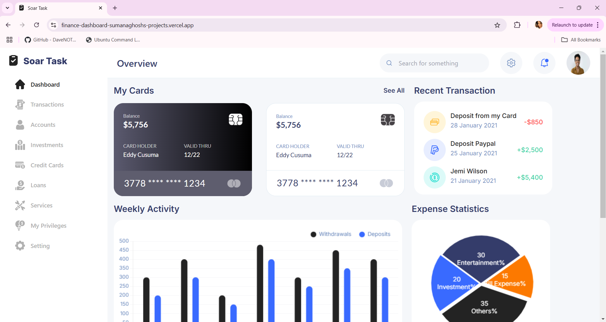

# React + Vite

This template provides a minimal setup to get React working in Vite with HMR and some ESLint rules.

Currently, two official plugins are available:

- [@vitejs/plugin-react](https://github.com/vitejs/vite-plugin-react/blob/main/packages/plugin-react/README.md) uses [Babel](https://babeljs.io/) for Fast Refresh
- [@vitejs/plugin-react-swc](https://github.com/vitejs/vite-plugin-react-swc) uses [SWC](https://swc.rs/) for Fast Refresh

# Finance Dashboard

A fully responsive and modern finance dashboard built with **Vite**, **React**, and **Redux**. This application includes various widgets and charts to visualize financial data and manage transactions efficiently.

<!--  -->


---

## Features

- **Responsive Design:** Adapts seamlessly to all screen sizes.
- **Redux Integration:** Efficient state management for a seamless experience.
- **React Icons:** Clean and professional icons used for UI elements.
- **Interactive Widgets:**
  - Card overview
  - Recent transactions
  - Weekly activity
  - Expense statistics (pie chart)
  - Quick transfer section
  - Balance history graph

## Tech Stack

- **Frontend Framework:** [React](https://reactjs.org/)
- **Build Tool:** [Vite](https://vitejs.dev/)
- **State Management:** [Redux](https://redux.js.org/)
- **Icons:** [React Icons](https://react-icons.github.io/react-icons/)

## Installation

1. Clone the repository:
   ```bash
   git clone https://github.com/your-username/finance-dashboard.git
   cd finance-dashboard
##
- **Install dependencies:** npm install
- **Start the development server:** npm run dev
- **Open your browser and navigate to:** http://localhost:5173

Scripts
npm run dev: Start the development server.
npm run build: Build the project for production.
npm run preview: Preview the production build locally.

