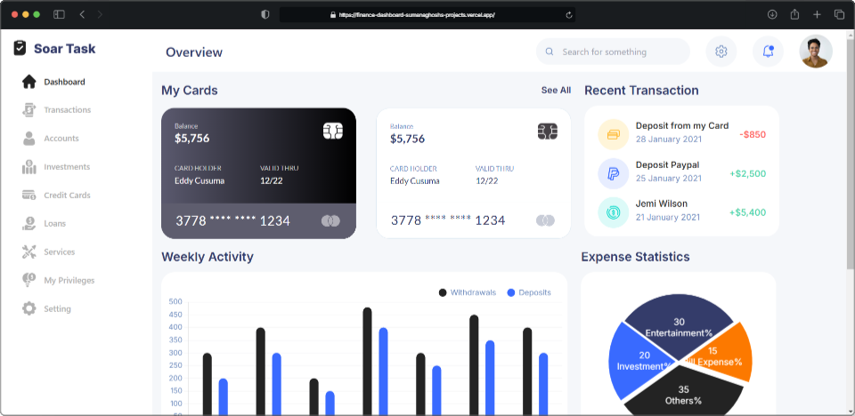
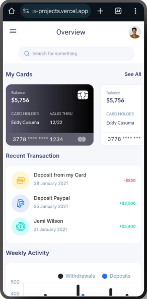
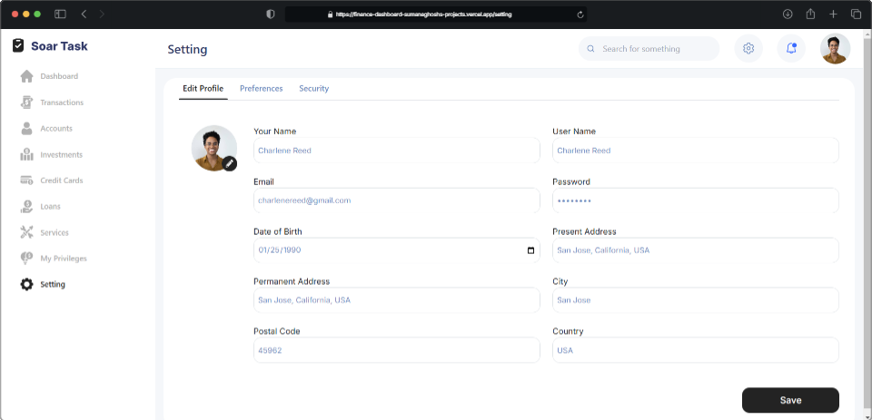

# Finance Dashboard

A fully responsive and modern finance dashboard built with **Vite**, **React**, and **Redux**. This application includes various widgets and charts to visualize financial data and manage transactions efficiently.

**You can visit this URL to view it** - (https://finance-dashboard-sumanaghoshs-projects.vercel.app/)

- **Responsive Design:** Adapts seamlessly to all screen sizes.
- **Redux Integration:** Efficient state management for a seamless experience.
- **React Icons:** Clean and professional icons used for UI elements.

**Dashbaord Desktop View**



**Dashbaord Mobile View**



---

## Dashboard Features

The Dashboard (Overview) provides users with a comprehensive summary of their financial data, including card balances, transaction history, activity charts, expense statistics, and quick transfer options. It is the main entry point of the Finance Dashboard application, offering a clean and visually appealing interface for easy navigation and insight.

- **Interactive Widgets:**
  - Card overview
  - Recent transactions
  - Weekly activity
  - Expense statistics (pie chart)
  - Quick transfer section
  - Balance history graph


**Setting Desktop View**



**Setting Mobile View**


---

## Setting Features

This component allows users to view and update their profile details, such as their name, email, password, date of birth, and addresses. It is part of the Settings module in the Finance Dashboard application.

- **Profile Overview:** Displays the user's current profile details.
- **Editable Fields:**
  - Full Name
  - Username
  - Email
  - Password
  - Date of Birth
  - Address (Present Address, Permanent Address, City, Postal Code, Country)
- **Profile Picture Update:** Allows users to change their profile picture.
- **Save Changes:** Save updates to the profile.

## Tech Stack

- **Frontend Framework:** [React](https://reactjs.org/)
- **Build Tool:** [Vite](https://vitejs.dev/)
- **State Management:** [Redux](https://redux.js.org/)
- **Icons:** [React Icons](https://react-icons.github.io/react-icons/)

## Installation

1. Clone the repository:
   ```bash
   git clone https://github.com/your-username/finance-dashboard.git
   cd finance-dashboard
##
- **Install dependencies:** npm install
- **Start the development server:** npm run dev
- **Open your browser and navigate to:** http://localhost:5173

**Scripts**
**npm run dev:** Start the development server.
**npm run build:** Build the project for production.
**npm run preview:** Preview the production build locally.

